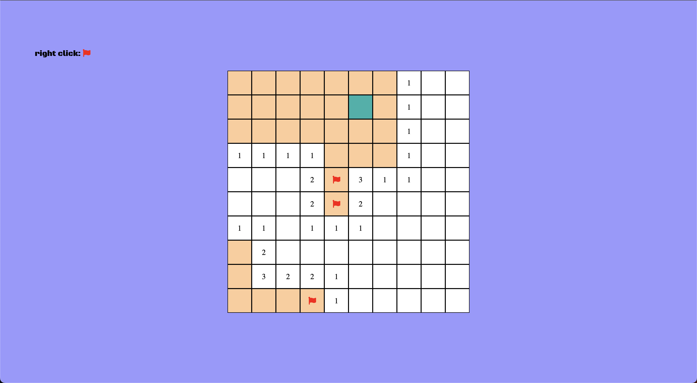
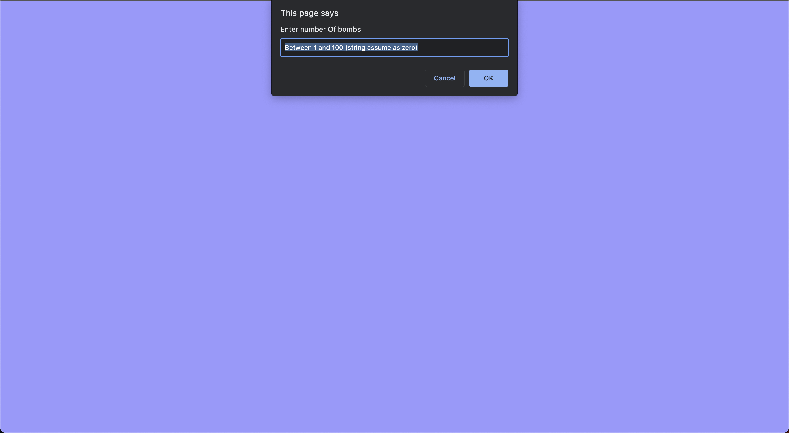
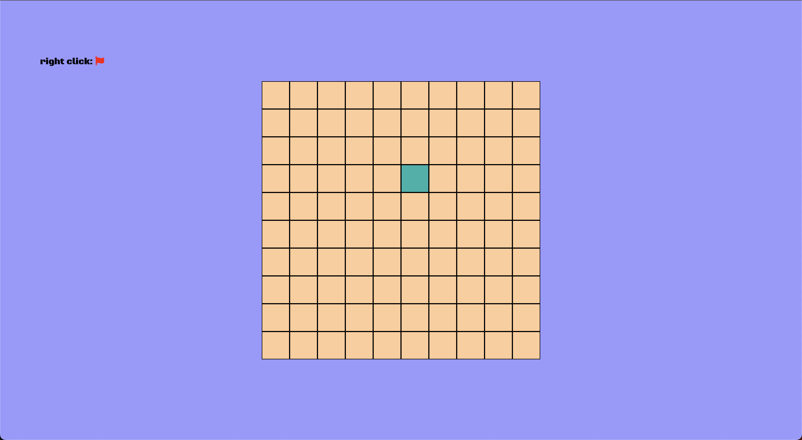
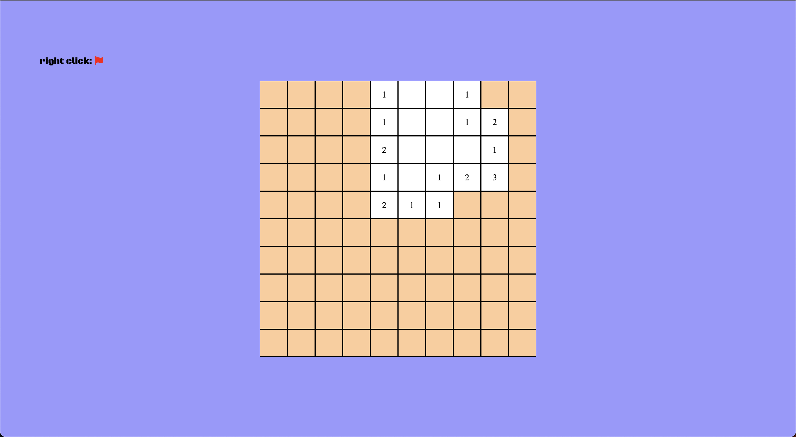
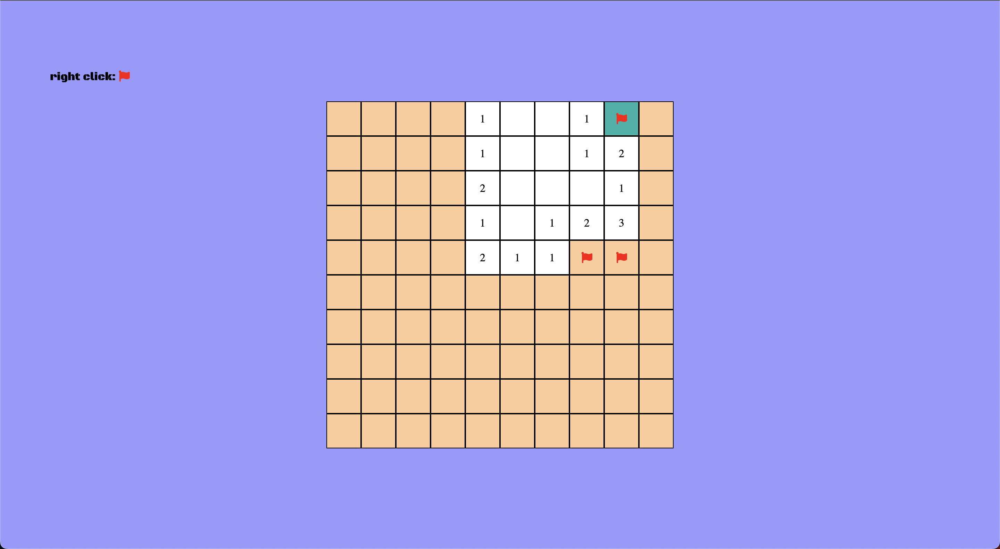
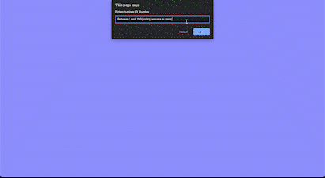
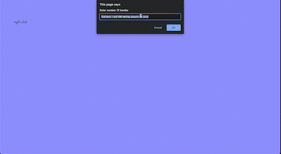

# Minesweeper Game 🎮
 

## Description 📋

This is a simple implementation of the classic Minesweeper game using HTML, CSS, and JavaScript. 

## How to start 🚀
1. Clone the repository: `git clone https://github.com/yourusername/minesweeper-game.git` 🔗
2. Open `index.html` in your web browser. 🌐

## How to Play 🕹️
### 1) Specify number of Bombs

🔴 It should be between 1 and 100 (Since we have 100 cells) 🔴

### 2) Hover your desired cell

✨ Now you can `Left-click` or `Right-click` on the cell

### Left-click

Hooray! We were lucky, and we didn't click on bombs 😎

### Right-click

We Defused three bombs with `Right-click`! 💣

## Notes
- You can `Right-click` again on flagged cell to undo.
- You will have as many flags as bombs.
- You'll lose if you `Left-click` on bombs.
- You'll win if Defuse all bombs.

### Winning Scenario

### Losing Scenario

 

## Happy Minesweeping! 🚀🎮💣